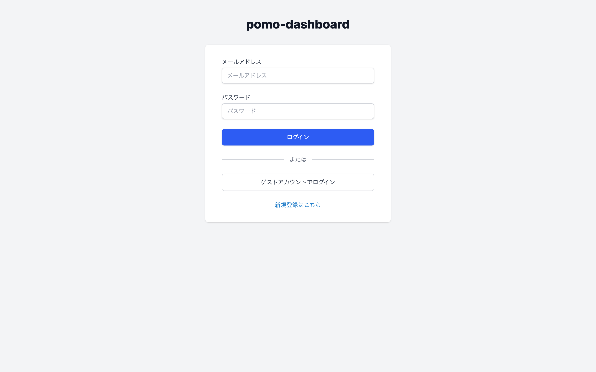
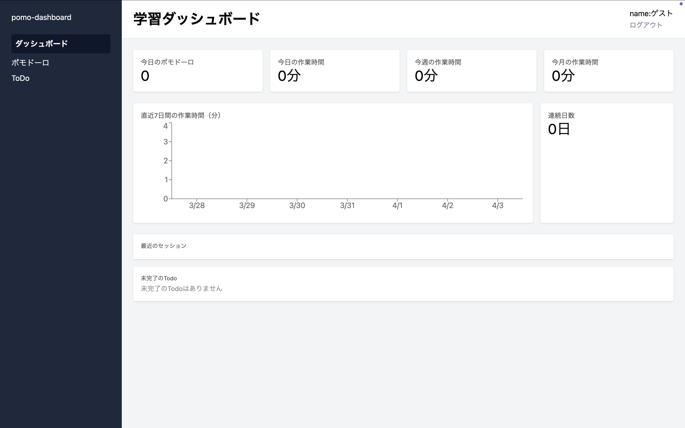
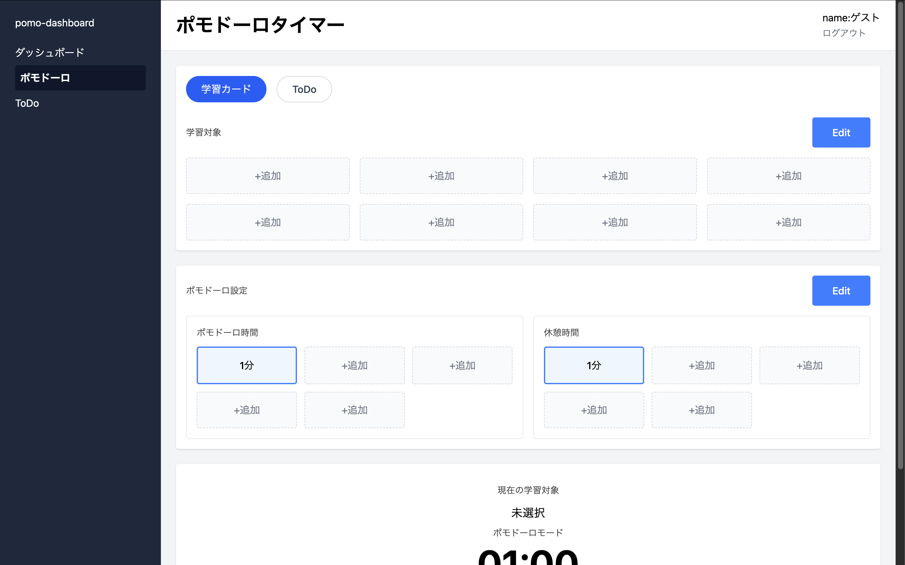
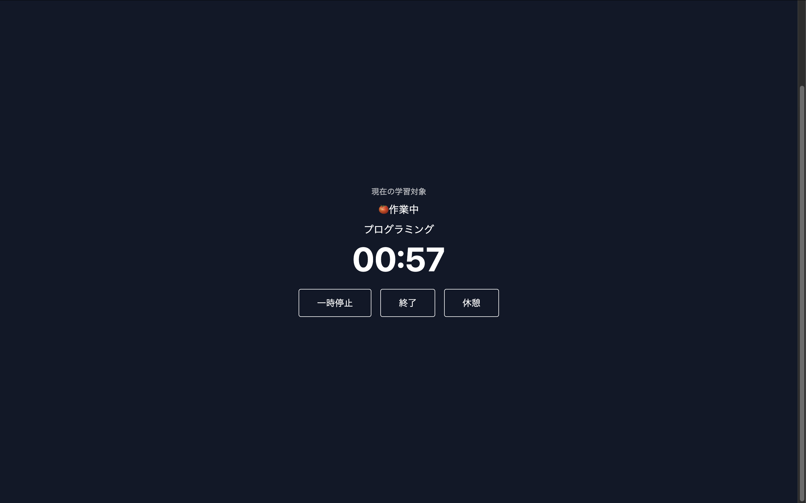
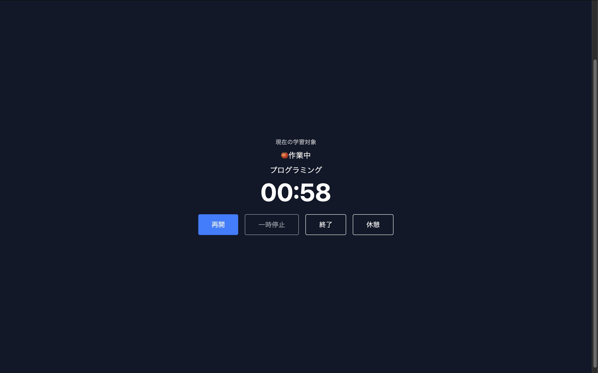
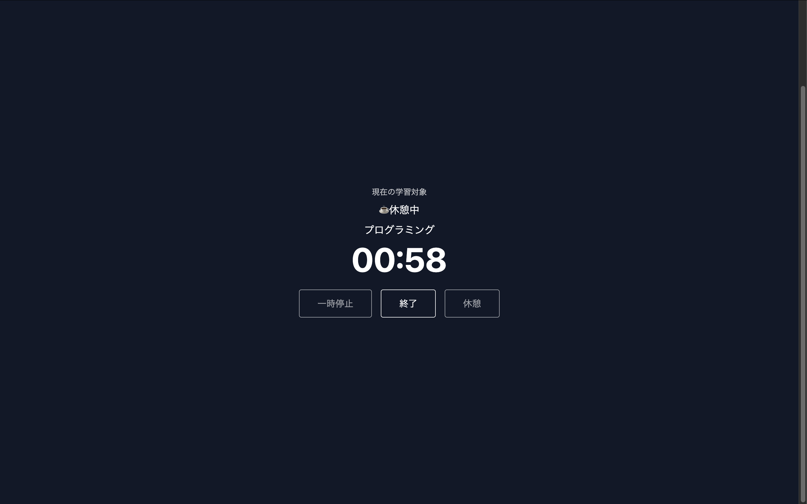
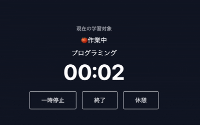
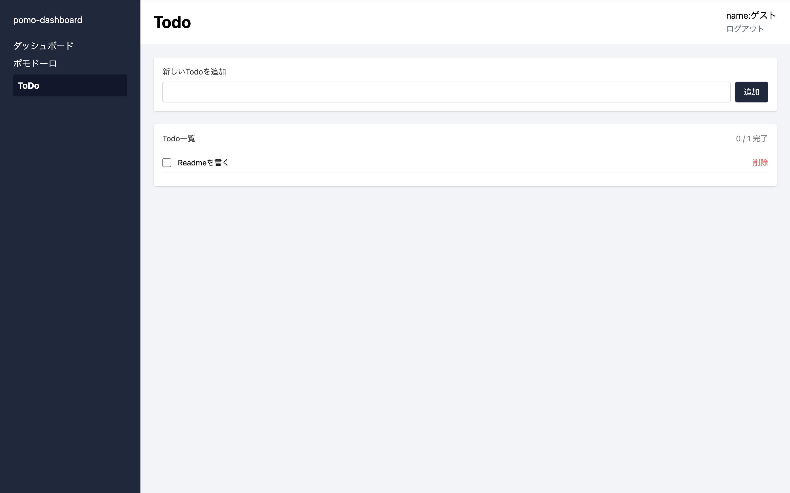

# pomo-dashboard

作業に集中するためのポモドーロタイマー＆ダッシュボードアプリです。
学習カード・Todo の管理から、作業セッションの記録・可視化まで一体化しています。

作るきっかけ
・これまでの学習記録はスマートフォンのアプリで行っていました。しかし、作業する時に近くにスマートフォンがあると そちらに意識が向いてしまうため、パソコンで管理できるようにと作成しました。

🔗 **デモ**: [https://pomo-dashboard-eta.vercel.app/](https://pomo-dashboard-eta.vercel.app/)
※ ゲストアカウントでログインするとすぐに試せます。

---

<!-- スクリーンショット：サインイン画面をここに挿入 -->

---

## 主な機能

- **ポモドーロタイマー** — 作業・休憩時間を自由に設定し、自動で交互に切り替わります
- **バックグラウンド対応** — 他のタブや別アプリを使用中もタイマーが正確に動作し、フェーズ切り替え時にブラウザ通知を送信します
- **学習カード / Todo 管理** — タイマーと連携して、今取り組む対象を選択できます
- **セッション記録** — 完了した作業をSupabaseに保存します
- **ダッシュボード** — 今日・今週・今月の作業時間、連続日数などを可視化します
- **認証** — メールアドレス登録 / ゲストログインに対応しています

---

## 画面

### ダッシュボード

<!-- スクリーンショット：ダッシュボード画面をここに挿入 -->

### タイマー（待機中）

<!-- スクリーンショット：タイマー待機画面をここに挿入 -->

### タイマー（作業中）

<!-- スクリーンショット：タイマー作業中オーバーレイをここに挿入 -->

### Todo

<!-- スクリーンショット：Todo画面をここに挿入 -->

---

## 技術スタック

| カテゴリ       | 使用技術                     |
| -------------- | ---------------------------- |
| フレームワーク | Next.js 15 (App Router)      |
| UI             | React 19 / Tailwind CSS v4   |
| 言語           | TypeScript                   |
| バックエンド   | Supabase (PostgreSQL / Auth) |
| デプロイ       | Vercel                       |

---

## 技術的なポイント

**タイマーの精度**
`setInterval` の発火遅延に依存しない `Date.now()` ベースの残り時間計算を採用しています。バックグラウンドタブでスロットリングが発生しても、タブに戻った瞬間に正確な残り時間を表示します。

**状態管理**
`useState` + `useRef` の組み合わせで、作業開始時刻・タイマーステータス・フェーズ遷移を管理しています。カスタムフック（`useTodos` / `useStudyCards` / `usePomoSettings` / `useSessions`）にデータ取得ロジックを分離しています。

**認証フロー**
Supabase Auth を使用し、各ページで `getSession()` によるセッション確認を行います。未認証時はサインインページへリダイレクトします。

---

## 今後の改善予定

- タイマー状態のページをまたいだ永続化（Context Provider 化）
- ユニットテストの追加
- ストップウォッチモードの実装
